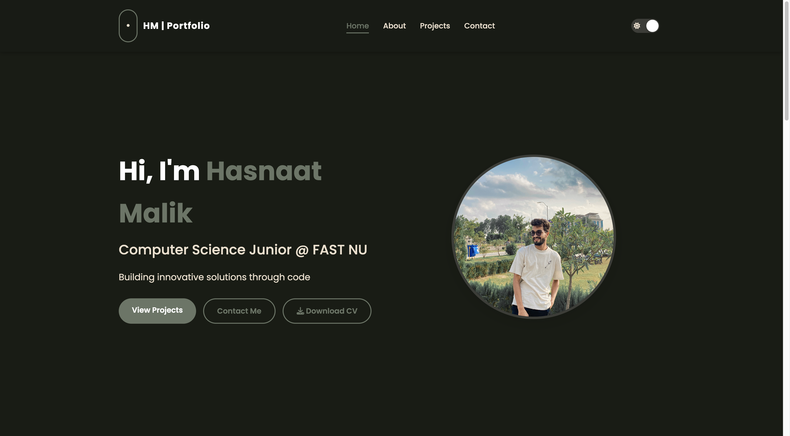

## Preview



## Features

- **Responsive Design**: Fully responsive layout that works seamlessly on devices of all sizes
- **Dark/Light Mode**: Toggle between dark and light themes with preferences saved in local storage
- **Smooth Animations**: Subtle animations enhance the user experience without being distracting
- **Interactive Elements**:
  - Typing effect on the homepage
  - Hover effects on projects and skills
- **Contact Form**: Functional contact form with validation
- **Accessibility**: Built with accessibility best practices in mind
- **Cross-Browser Compatibility**: Works on all modern browsers

## Tech Stack

- **HTML5**: Semantic markup for structure
- **CSS3**:
  - Flexbox and Grid for layouts
  - CSS Variables for theming
  - Media queries for responsiveness
  - CSS animations and transitions
- **JavaScript**:
  - DOM manipulation
  - Event handling
  - Local storage for theme preference
  - Form validation
  - Smooth scrolling
  - Animation control

## Project Structure

```
portfolio/
├── index.html              # Main HTML file
├── css/
│   └── style.css           # All styles
├── js/
│   └── main.js             # JavaScript functionality
├── images/
│   ├── profile.jpeg        # Profile image
│   ├── preview.png         # Project preview image
└── README.md               # Project documentation
```

## Installation & Usage

### Local Development

1. Clone the repository:

   ```bash
   git clone https://github.com/hasnaatmalik/portfolio.git
   cd portfolio
   ```

2. Open the project in your code editor
3. Launch with a local server:

   - Using VS Code's Live Server extension

4. View in your browser at `http://localhost:8000` (or the port specified by your server)

## Customization

### Changing Colors

The color scheme can be easily modified by editing the CSS variables in the `:root` selector in `style.css`:

```css
:root {
  --black: #000000;
  --dark-gray: #404040;
  --light-gray: #c4c4c4;
  --dark-olive: #181c14;
  --gray-olive: #3c3d37;
  --sage-green: #697565;
  --light-beige: #ecdfcc;
  --white: #ffffff;
  --bg-color: #fafafa;
  /* Add or modify colors here */
}
```

### Adding Projects

To add a new project, copy and modify the existing project card structure in the HTML:

```html
<div class="project-card">
  <div class="project-content">
    <h3>Project Title</h3>
    <p>Project description goes here...</p>
    <div class="project-tags">
      <span>Tag 1</span>
      <span>Tag 2</span>
    </div>
    <div class="project-links">
      <a href="project-url" target="_blank" class="btn project-btn">
        <i class="fab fa-github"></i> View on GitHub
      </a>
    </div>
  </div>
</div>
```

## Live Demo

[View the live portfolio](https://hasnaatmalik.github.io/portfolio/)

## Author & Contact

**Hasnaat Malik**

- Email: [hasnaatmalik2003@gmail.com](mailto:hasnaatmalik2003@gmail.com)
- LinkedIn: [linkedin.com/in/hasnaatmalik](https://www.linkedin.com/in/hasnaatmalik/)
- GitHub: [github.com/hasnaatmalik](https://github.com/hasnaatmalik)

## License

This project is open source and available under the [MIT License](LICENSE).
